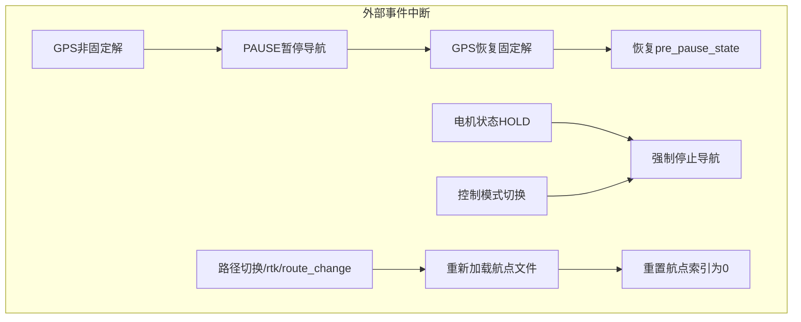
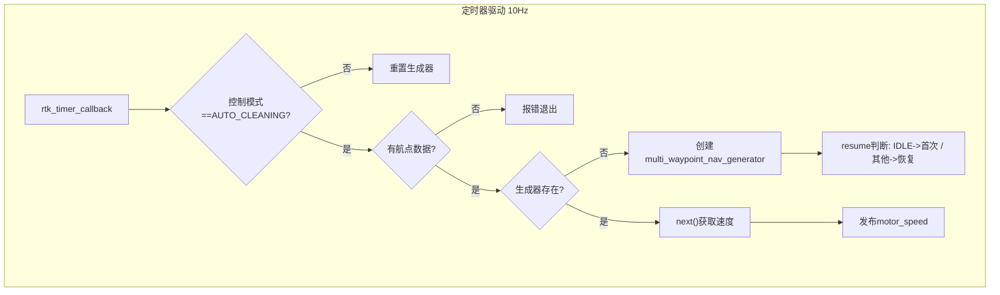
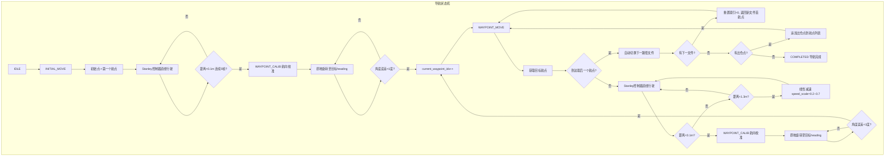
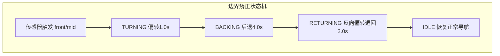
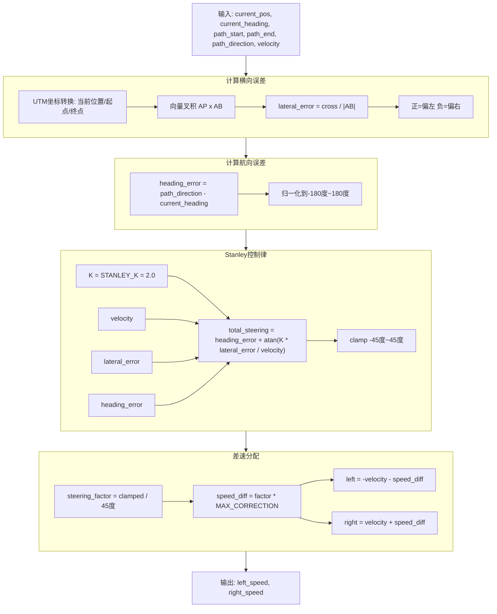
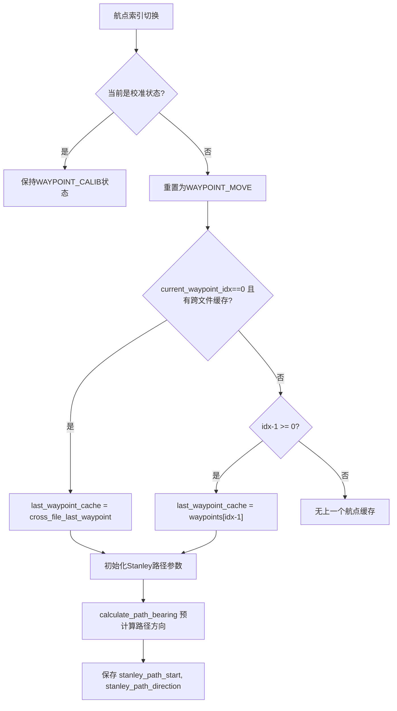
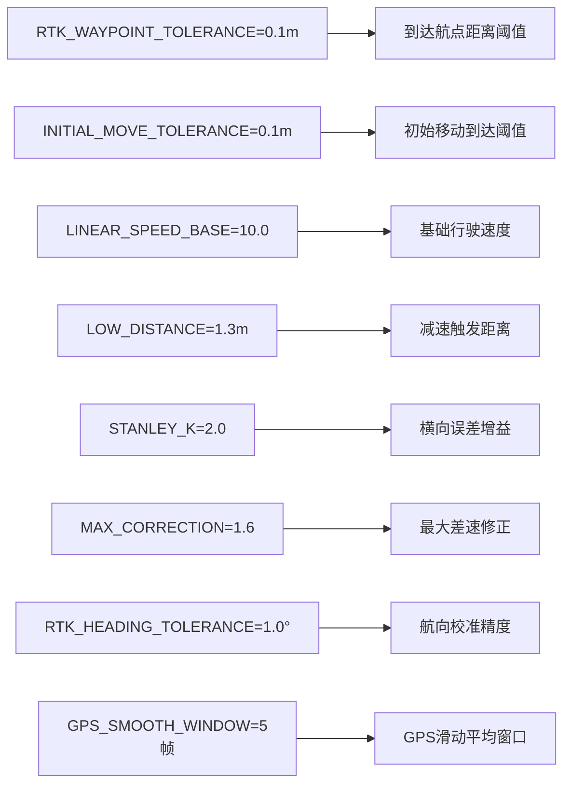

#  RTK循迹 Ros2

1、 打点建图，保存路径，到launch.py中切换对应路径
    地图通过起始点经纬度，倾角，指定轨迹起点、地图间隔等确定。

2、 播放录制bag测试，启动launch中的wtrtk_parse_txt

3、 通过话题发布

    ros2 topic pub /keyboard/control std_msgs/msg/String "{data: 'r'}" -1
    进入RTK导航模式，默认为Normal模式可以键盘发布控制不能RTK导航。

    通过话题发布
    ros2 topic pub /keyboard/control std_msgs/msg/String "{data: 'n'}" -1
    切换正常模式，键盘控制，发布w/s/a/d控制运动，z停止，x使能

    通过话题发布
    ros2 topic pub /keyboard/control std_msgs/msg/String "{data: 'm'}" -1
    进入遥控模式

4、 实时导航测试
    注释wtrtk_parse_txt，启动launch中的wtrtk_serial_driver
    进入实时导航，提前进行步骤1确定路径

## 无线充电
### 开始充电

ros2 service call /start_charging custom_msgs/srv/ChargeControl "{}"

### 停止充电
ros2 service call /stop_charging custom_msgs/srv/ChargeControl "{}"

### 查询电压电流
ros2 service call /query_volt_curr std_srvs/srv/Trigger "{}"

### 实时订阅故障码话题
ros2 topic echo /charging_fault_code std_msgs/msg/Int16

## RTK导航流程图

### 主状态机

### 导航状态机 

### 边界矫正状态机

### Stanley控制器流程

### 航点切换与跨文件处理

### 关键参数
