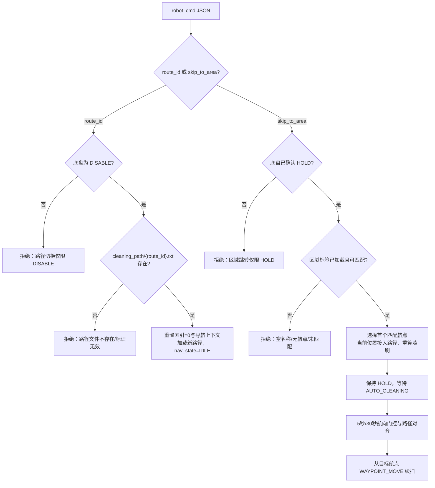
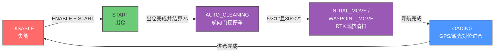
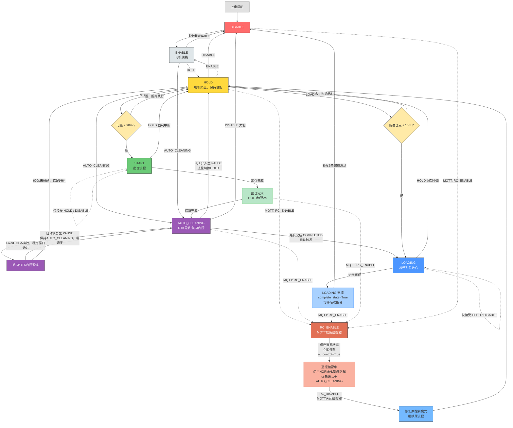
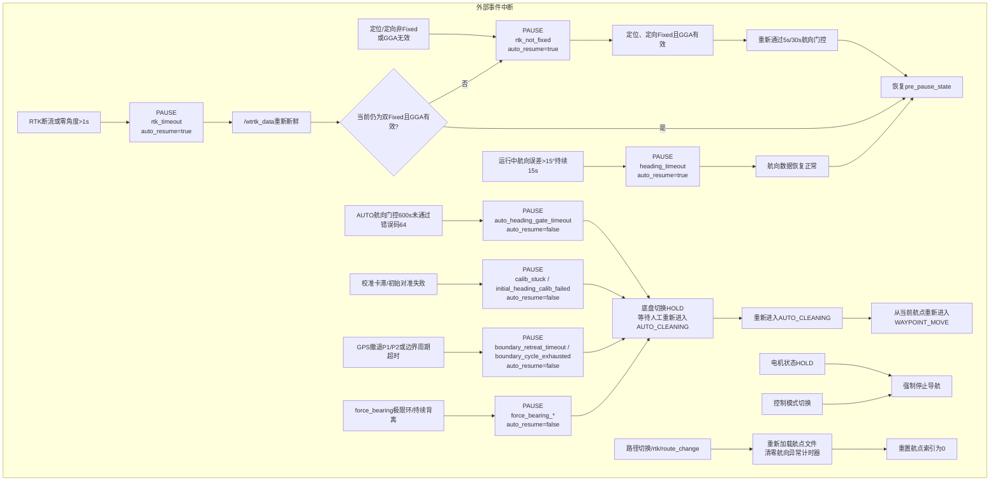
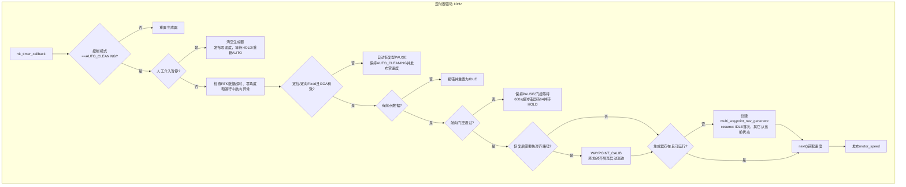
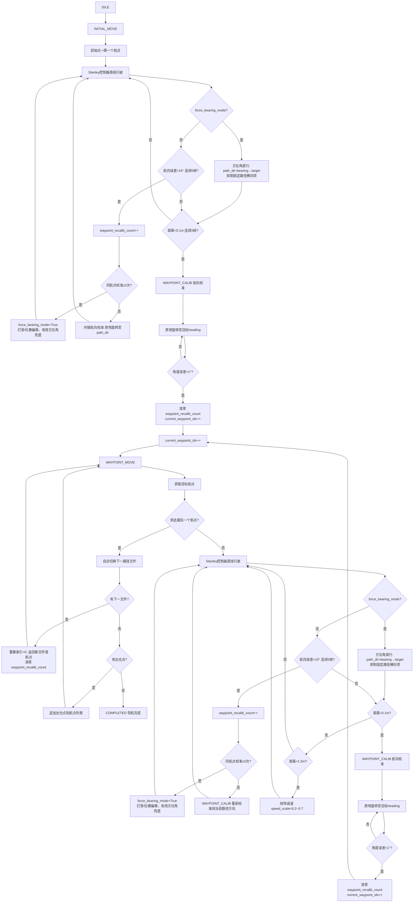
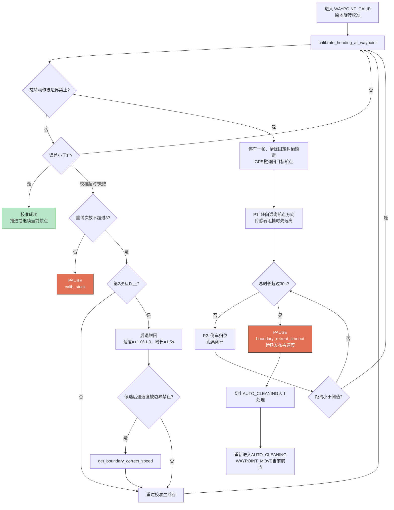
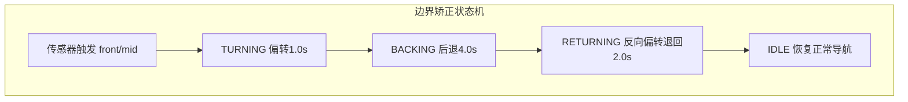
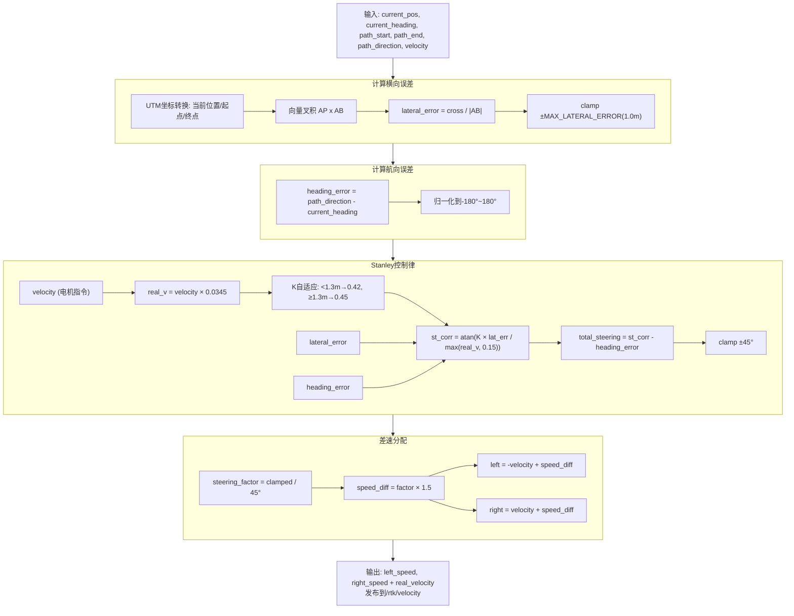
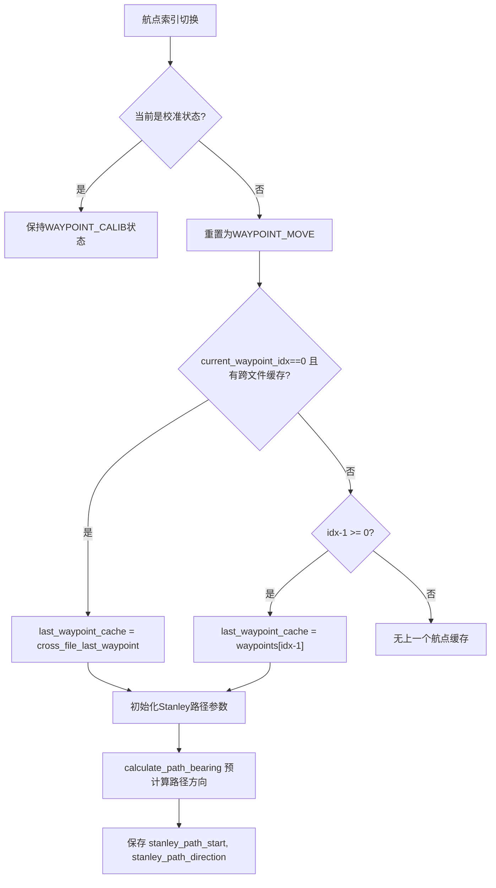

# RTK 循迹 ROS2

## 当前运行版本

系统由 `motor_control` 底盘状态机和 `rtk_nav` 航点导航节点组成。AUTO 清扫的有效路径为：

`AUTO_CLEANING` → 航向门控停车 → `INITIAL_MOVE`/`WAYPOINT_MOVE` → 航点原地校准 → `COMPLETED` → `LOADING`。

进入 AUTO 后，`rtk_nav` 必须同时确认定位 Fixed、定向 Fixed 且 GGA 数据有效，然后连续采集 5 秒短窗和 30 秒收敛窗（分别 ≤1°、≤2°）。运行中 Float ≤3 秒桥接已有 Fixed 历史；超过 3 秒清空窗口，重新完整采集 5 秒短窗和 30 秒收敛窗。

自动恢复型暂停保持底盘 `AUTO_CLEANING`，只输出零速度；`calib_stuck`、航向校准失败、边界 GPS 撤退超时、force bearing 极限环，以及航向门控 600 秒超时属于人工介入暂停，底盘切换 `HOLD`。导航状态通过 `/rtk/nav_state` 发布 JSON，包含 `pause_reason`、`auto_resume` 和递增 `seq`。

暂停协议按结构化字段处理：`auto_resume=true` 时底盘不改变控制模式，只清零左右轮和滚刷速度；`auto_resume=false` 时底盘将 `AUTO_CLEANING` 切换到 `HOLD/NORMAL`，等待人工重新进入 AUTO。底盘按 `seq` 丢弃旧状态，不能仅根据 `nav_state="PAUSE"` 字符串决策。

1、 打点建图，保存路径，到launch.py中切换对应路径
    地图通过起始点经纬度，倾角，指定轨迹起点、地图间隔等确定。

2、 播放录制bag测试，启动launch中的wtrtk_parse_txt

3、 通过话题发布

    ros2 topic pub /keyboard/control std_msgs/msg/String "{data: 'r'}" -1
    进入RTK导航模式，默认为Normal模式可以键盘发布控制不能RTK导航。

    通过话题发布
    ros2 topic pub /keyboard/control std_msgs/msg/String "{data: 'n'}" -1
    切换正常模式，键盘控制，发布w/s/a/d控制运动，z停止，x使能

    通过话题发布
    ros2 topic pub /keyboard/control std_msgs/msg/String "{data: 'm'}" -1
    切换 NORMAL 模式（旧 REMOTE 模式已废弃）

4、 实时导航测试
    注释wtrtk_parse_txt，启动launch中的wtrtk_serial_driver
    进入实时导航，提前进行步骤1确定路径

## 路径切换与区域跳转

路径标识 `route_id` 是清扫路径文件的文件名去掉 `.txt` 后缀，例如
`008-W19-W16` 对应 `cleaning_path/008-W19-W16.txt`。`rtk_nav` 通过
`/rtk/current_route_id` 发布当前实际加载的标识，`motor_control` 将其同步到
`/robot_state` 的 `route_id` 字段；它不是单纯的显示字段，而是当前导航文件的标识。

### 修改 `route_id`（切换整条路径）

通过 `robot_cmd` 发送下列任一 JSON；`route_id` 不带 `.txt` 后缀：

```bash
ros2 topic pub /robot_cmd std_msgs/msg/String \
  '{data: "{\"route_id\":\"008-W19-W16\"}"}' -1

# 兼容写法
ros2 topic pub /robot_cmd std_msgs/msg/String \
  '{data: "{\"command\":\"CHANGE_ROUTE\",\"route_id\":\"008-W19-W16\"}"}' -1
```

限制条件：

- 仅在底盘状态为 `DISABLE` 时受理；`ENABLE`、`HOLD`、`START`、`LOADING` 和 `AUTO_CLEANING` 均会拒绝。
- 文件必须存在于设备配置的 `cleaning_path/{route_id}.txt`；不存在、空 `route_id` 或带错后缀（如传入 `xxx.txt`）不会切换。
- 成功后导航节点清空旧航点、滚刷事件、校准/边界/force-bearing 上下文和航向异常计时器，将航点索引置为 `0`、导航状态置为 `IDLE`，再加载新文件并发布新的 `route_id`。
- 切换路径不自动启动清扫；标准作业流程是随后下发 `START`，出仓结算后进入 `AUTO_CLEANING` 航向门控。

### `skip_to_area`（从指定区域续扫）

区域跳转仅接受如下 JSON：

```bash
ros2 topic pub /robot_cmd std_msgs/msg/String \
  '{data: "{\"skip_to_area\":\"bridge_E3out2-E3\"}"}' -1
```

限制与行为：

- 命令入口与 `rtk_nav` 接收端均要求底盘已确认处于 `HOLD`；任何一个检查发现不是 `HOLD` 都会拒绝。不要在 `AUTO_CLEANING` 行驶时直接跳转。
- 区域名不能为空，且当前路径必须已加载航点及区域标签；否则不改变索引。
- 匹配优先级为**精确匹配**、**前缀匹配**（`area.startswith(target)`）、**双向包含匹配**。匹配到多个不同区域时，按路径文件中的先后顺序选择第一个，并在日志中列出候选区域；因此应优先传完整区域名，避免依赖前缀/包含匹配。
- 跳转到匹配区域的首个航点。若当前位置有效，以当前位置建立接入航段；否则回退使用目标航点的前一航点（首航点则使用自身）。旧 Stanley 路径方向不会沿用。
- 跳转会重置校准、边界撤退和 force-bearing 上下文，清除错误码 `128`，并按目标航点索引重新计算滚刷状态；跳入 `#start` 与 `#stop` 之间时滚刷会在恢复 AUTO 后开启。
- 跳转完成时 `rtk_nav` 会发布计划恢复状态 `WAYPOINT_MOVE`，但底盘仍处于 `HOLD`，不会运动。随后重新进入 `AUTO_CLEANING`，仍必须通过 5 秒/30 秒航向门控并完成必要的路径对齐，才从目标航点开始行驶。




## 无线充电
### 开始充电

ros2 service call /start_charging custom_msgs/srv/ChargeControl "{}"

### 停止充电
ros2 service call /stop_charging custom_msgs/srv/ChargeControl "{}"

### 查询电压电流
ros2 service call /query_volt_curr std_srvs/srv/Trigger "{}"

### 实时订阅故障码话题
ros2 topic echo /charging_fault_code std_msgs/msg/Int16


## RTK导航流程图

### 自动清扫简化流程



### 主状态机





### 导航状态机 


### 航向校准与边界撤退安全分支



### 边界矫正状态机


### Stanley控制器流程


### 航向异常保护

- **局部重校准**: 导航行驶中航向误差超过 15° 连续 5 帧（0.5s），先在当前航点触发重校准；同一航点反复校准后进入 `force_bearing_mode` 兜底。
- **force bearing**: 使用当前位置到目标的实时方位角，关闭固定路径段的横向项；误差超过 15° 仍先原地对准。极限环或持续背离时发布人工介入暂停并使用错误码 128。
- **全局航向异常**: 航向异常连续超过 15s 时设置错误码 8，进入 `heading_timeout` 自动恢复型 PAUSE；恢复判据是航向数据恢复正常，不等同于 AUTO 航向稳定门控通过。
- **RTK 数据超时**: `/wtrtk_data` 超过 1s 未更新，或 `angle_x/angle_y` 持续为 0 超过 1s，设置错误码 8 并停车；数据恢复且质量仍为双Fixed时回到原导航阶段，若仍非Fixed则转入 `rtk_not_fixed` 并重新经过航向门控。
- **模式切入清理**: 进入 `AUTO_CLEANING` 或切换路径时清零 `heading_abnormal_start_time` 和 `heading_timed_out`，防止旧任务污染。
- 单帧跳变只累计一次，下一帧恢复到阈值内会清零计数，避免 RTK/IMU 瞬时抖动误判。
- 异常重校准完成后不推进航点索引，继续前往当前航点；正常到达航点后的校准才推进到下一个航点。

### 航点切换与跨文件处理


### 关键参数

| 参数 | 值 | 说明 |
|------|-----|------|
| LINEAR_SPEED_BASE | 10.0 | 基础行驶速度（电机指令值，约0.35m/s） |
| SPEED_LIMIT | 1.3 × BASE | 最大速度限制 |
| SPEED_CMD_TO_MPS | 0.0345 | 电机指令→真实速度(m/s)转换系数 |
| RTK_WAYPOINT_TOLERANCE | 0.10 m | 到达航点距离阈值 |
| INITIAL_MOVE_TOLERANCE | 0.10 m | 初始移动到达阈值 |
| LOW_DISTANCE | 1.5 m | 减速触发距离 |
| RTK_HEADING_TOLERANCE | 1.0° | 航向校准精度 |
| STANLEY_K_NEAR (<1.3m) | 0.42 | 近距离自适应 K |
| STANLEY_K_FAR (≥1.3m) | 0.45 | 远距离自适应 K |
| STANLEY_MIN_SPEED | 0.15 m/s | Stanley 计算最小速度（防除零+限幅） |
| MAX_LATERAL_ERROR | 1.0 m | 横向误差钳位上限 |
| STRAIGHT_MAX_CORRECTION | 1.5 | 直线最大差速修正 |
| HEADING_ABNORMAL_THRESHOLD | 15.0° | 航向异常阈值 |
| ANGLE_ABNORMAL_COUNT | 5 | 连续异常帧数（0.5s） |
| RTK_DATA_TIMEOUT | 1.0 s | RTK 数据断流超时停车 |
| RTK_ZERO_ANGLE_TIMEOUT | 1.0 s | angle_x/angle_y持续为0的异常超时 |
| HEADING_ABNORMAL_TIMEOUT | 15.0 s | 运行中航向误差持续超时，错误码8 |
| HEADING_STABILITY_WINDOW | 5.0 s | AUTO门控短窗，波动≤1° |
| HEADING_STABILITY_RANGE | 1.0° | 5秒短窗最大允许波动 |
| HEADING_STABILITY_SETTLE_WINDOW | 30.0 s | AUTO门控收敛窗口 |
| HEADING_STABILITY_SETTLE_RANGE | 2.0° | 30秒收敛窗口最大允许跨度 |
| HEADING_QUALITY_GAP_MAX | 3.0 s | Float/非Fixed最长桥接间隔；超时清空窗口 |
| HEADING_FIXED_CONFIRM_WINDOW | 1.0 s | 短时恢复双Fixed后的确认停车时间 |
| AUTO_HEADING_GATE_TIMEOUT | 600.0 s | AUTO航向门控超时，错误码64并转HOLD |
| UNLOADING_MIN_BATTERY | 90% | START出仓最低电量 |
| UNLOADING_SETTLE_DURATION | 2.0 s | 出仓完成后HOLD结算时间 |
| force_bearing_mode | ≥2次 | 同航点重校准后启用实时方位角兜底 |
| FORCE_BEARING_REALIGN_THRESHOLD | 15.0° | force_bearing_mode 下航向偏差超此值触发原地重新对准 |

### 当前运行时故障码

以下为导航/任务故障码，按位或组合发布；底盘另有电机故障码 `1` 和激光超时码 `2`。

| 故障码 | 当前含义 | 处理方式 |
|---:|---|---|
| 4 | RTK 定位或定向不是 Fixed，或 GGA 数据无效 | 自动停车并保持 `AUTO_CLEANING`，等待质量恢复后重新通过航向门控 |
| 8 | `/wtrtk_data` 断流超过 1s、`angle_x/angle_y` 持续为 0 超过 1s，或运行中航向误差超过 15° 持续 15s | 自动停车暂停；RTK/航向数据恢复后自动恢复，恢复判据不等同于航向稳定 |
| 16 | START 时电量低于 90% | 拒绝出仓，保持当前状态 |
| 32 | 进仓导航/激光对位流程超时或前置条件失败 | 停车并进入 HOLD，检查位置和进仓状态 |
| 64 | AUTO 航向门控等待 600s 仍未通过 | 设置错误码并进入人工介入 HOLD；重新进入 AUTO 后重新采集稳定窗口 |
| 128 | 航向校准卡滞/超时、初始对准失败、边界 GPS 撤退超时、force bearing 极限环或持续背离 | 停车并进入人工介入 HOLD；人工处理后从当前航点续扫 |

## 批量生成清扫路径

`batch_generate_paths.py` —— 不依赖 ROS2 环境，直接读取 YAML 配置，调用路径规划核心函数生成清扫路径 txt 文件。

```bash
# 基础用法（只生成 txt，不画图）
python batch_generate_paths.py

# 输出目录: src/rtk_nav/rtk_nav/cleaning_path/
# 读取目录: src/rtk_nav/rtk_nav/config/
```

- 遍历 `config/` 下所有 `*.yaml` 配置文件
- 每个配置文件生成一个 `{配置名}.txt` 密集点路径文件
- 图片绘制已注释，需要时取消注释 `plot_multi_area_path` 和 matplotlib 导入即可
