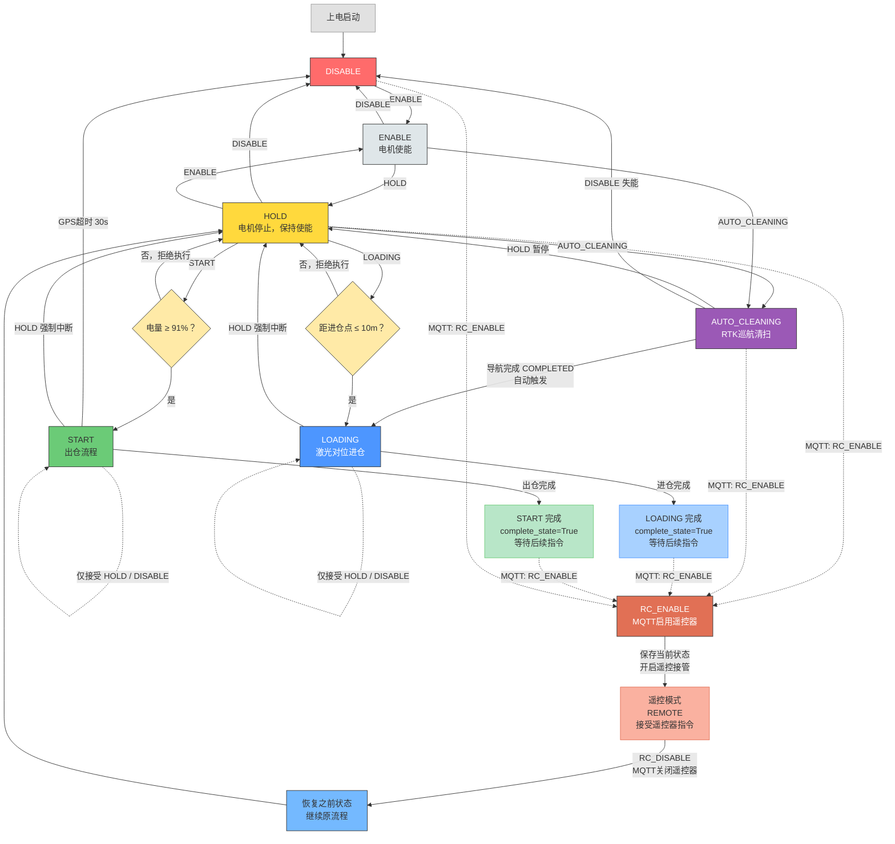
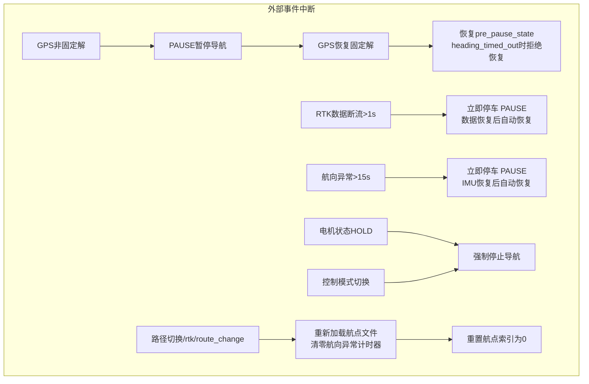
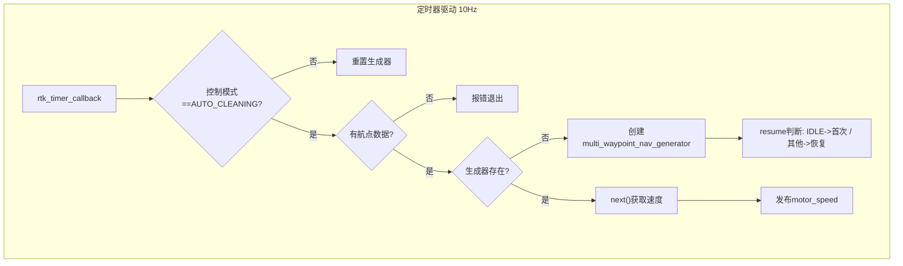
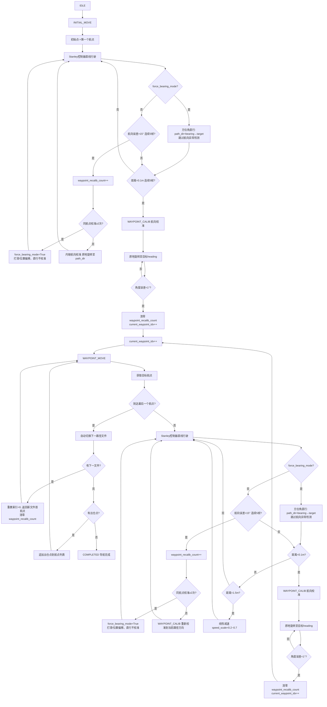
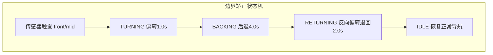
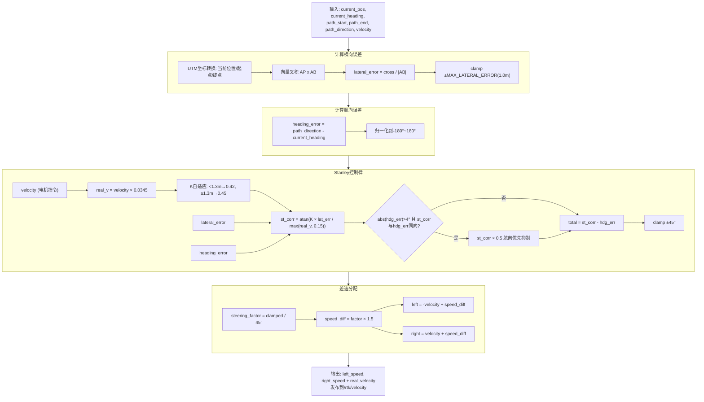
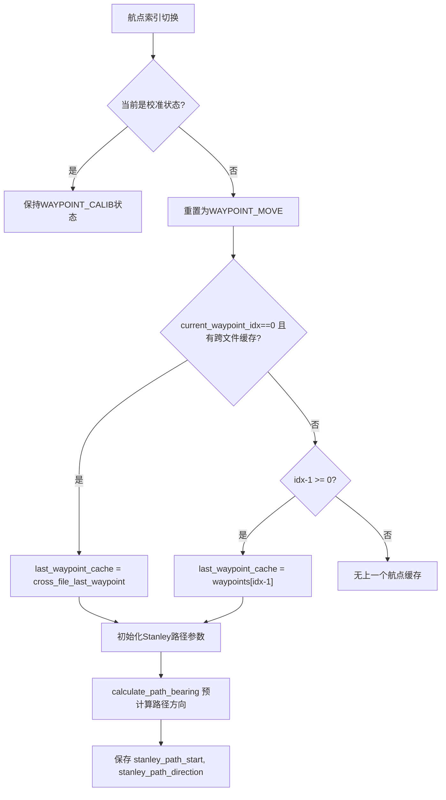

#  RTK循迹 Ros2

1、 打点建图，保存路径，到launch.py中切换对应路径
    地图通过起始点经纬度，倾角，指定轨迹起点、地图间隔等确定。

2、 播放录制bag测试，启动launch中的wtrtk_parse_txt

3、 通过话题发布

    ros2 topic pub /keyboard/control std_msgs/msg/String "{data: 'r'}" -1
    进入RTK导航模式，默认为Normal模式可以键盘发布控制不能RTK导航。

    通过话题发布
    ros2 topic pub /keyboard/control std_msgs/msg/String "{data: 'n'}" -1
    切换正常模式，键盘控制，发布w/s/a/d控制运动，z停止，x使能

    通过话题发布
    ros2 topic pub /keyboard/control std_msgs/msg/String "{data: 'm'}" -1
    进入遥控模式

4、 实时导航测试
    注释wtrtk_parse_txt，启动launch中的wtrtk_serial_driver
    进入实时导航，提前进行步骤1确定路径

## 无线充电
### 开始充电

ros2 service call /start_charging custom_msgs/srv/ChargeControl "{}"

### 停止充电
ros2 service call /stop_charging custom_msgs/srv/ChargeControl "{}"

### 查询电压电流
ros2 service call /query_volt_curr std_srvs/srv/Trigger "{}"

### 实时订阅故障码话题
ros2 topic echo /charging_fault_code std_msgs/msg/Int16

## RTK导航流程图

### 主状态机

### 导航状态机 

### 边界矫正状态机

### Stanley控制器流程

### 航向异常保护

- **连续异常检测**: 导航行驶中航向误差超过 15° 连续 5 帧（0.5s），判定为异常航向，触发重校准。
- **方位角模式排除**: t>1.0（越过投影终点）或 force_bearing_mode 时，航向误差来自侧向接近目标（几何现象而非 IMU 异常），跳过航向异常计数和超时计时。
- **打滑/偏移兜底**: 同航点重校准 ≥2 次后自动切换 `force_bearing_mode`，直接用 `bearing(current→target)` 直行，不再校准航向。航点切换后清零。
- **RTK 数据超时**: `/wtrtk_data` 超过 1s 未更新立即停车 PAUSE；数据新鲜即为恢复条件（不再检查航向误差绝对值，避免 IMU 漂移导致无法恢复）。
- **模式切入清理**: 进入 AUTO_CLEANING / 路径切换时清零 `heading_abnormal_start_time` 和 `heading_timed_out`，防止旧任务污染。
- 单帧跳变只累计一次，下一帧恢复到阈值内会清零计数，避免 RTK/IMU 瞬时抖动误判。
- 异常重校准完成后不推进航点索引，继续前往当前航点；正常到达航点后的校准仍会推进到下一个航点。

### 航点切换与跨文件处理

### 关键参数

| 参数 | 值 | 说明 |
|------|-----|------|
| LINEAR_SPEED_BASE | 10.0 | 基础行驶速度（电机指令值，约0.35m/s） |
| SPEED_LIMIT | 1.3 × BASE | 最大速度限制 |
| SPEED_CMD_TO_MPS | 0.0345 | 电机指令→真实速度(m/s)转换系数 |
| RTK_WAYPOINT_TOLERANCE | 0.10 m | 到达航点距离阈值 |
| INITIAL_MOVE_TOLERANCE | 0.10 m | 初始移动到达阈值 |
| LOW_DISTANCE | 1.5 m | 减速触发距离 |
| RTK_HEADING_TOLERANCE | 1.0° | 航向校准精度 |
| STANLEY_K_NEAR (<1.3m) | 0.42 | 近距离自适应 K |
| STANLEY_K_FAR (≥1.3m) | 0.45 | 远距离自适应 K |
| STANLEY_MIN_SPEED | 0.15 m/s | Stanley 计算最小速度（防除零+限幅） |
| MAX_LATERAL_ERROR | 1.0 m | 横向误差钳位上限 |
| STRAIGHT_MAX_CORRECTION | 1.5 | 直线最大差速修正 |
| HEADING_ABNORMAL_THRESHOLD | 15.0° | 航向异常阈值 |
| ANGLE_ABNORMAL_COUNT | 5 | 连续异常帧数（0.5s） |
| 航向优先抑制 | abs(hdg_err)>4° | 横向项与航向项同向时 st_corr 减半 |
| RTK_DATA_TIMEOUT | 1.0 s | RTK 数据断流超时停车 |
| force_bearing_mode | ≥2次 | 同航点重校准次数阈值，触发后方位角直行 |
