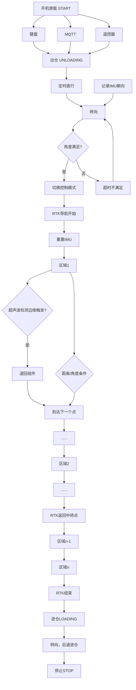

RTK循迹测试 Ros2

1、 打点建图，保存路径，到launch.py中切换对应路径
    地图通过起始点经纬度，倾角，指定轨迹起点、地图间隔等确定。

2、 播放录制bag测试，启动launch中的wtrtk_parse_txt

3、 通过话题发布
    ros2 topic pub /keyboard/control std_msgs/msg/String "{data: 'r'}" -1
    进入RTK导航模式，默认为Normal模式可以键盘发布控制不能RTK导航。

    通过话题发布
    ros2 topic pub /keyboard/control std_msgs/msg/String "{data: 'n'}" -1
    切换正常模式，键盘控制，发布w/s/a/d控制运动，z停止，x使能

    通过话题发布
    ros2 topic pub /keyboard/control std_msgs/msg/String "{data: 'm'}" -1
    进入原遥控解析模式(未测试)

4、 实时导航测试
    注释wtrtk_parse_txt，启动launch中的wtrtk_serial_driver
    进入实时导航，提前进行步骤1确定路径

ros2 topic pub /fix sensor_msgs/msg/NavSatFix "{header: {stamp: {sec: 0, nanosec: 0}, frame_id: ''}, status: {status: 4, service: 0}, latitude: 30.32088536, longitude: 120.06717012, altitude: 0.0, position_covariance: [0.0, 0.0, 0.0, 0.0, 0.0, 0.0, 0.0, 0.0, 0.0], position_covariance_type: 0}" -r 1
ros2 topic pub /fix sensor_msgs/msg/NavSatFix "{header: {stamp: {sec: 0, nanosec: 0}, frame_id: ''}, status: {status: 4, service: 0}, latitude: 30.32009074, longitude: 120.06899750, altitude: 0.0, position_covariance: [0.0, 0.0, 0.0, 0.0, 0.0, 0.0, 0.0, 0.0, 0.0], position_covariance_type: 0}" -r 1
ros2 topic pub /fix sensor_msgs/msg/NavSatFix "{header: {stamp: {sec: 0, nanosec: 0}, frame_id: ''}, status: {status: 4, service: 0}, latitude: 30.32005031, longitude: 120.06719501, altitude: 0.0, position_covariance: [0.0, 0.0, 0.0, 0.0, 0.0, 0.0, 0.0, 0.0, 0.0], position_covariance_type: 0}" -r 1
序号,经度,纬度,航向角(度)
1,120.07064157,30.32105564,88.51
2,120.07065098,30.32105585,338.51

ros2 topic pub /fix sensor_msgs/msg/NavSatFix "{header: {stamp: {sec: 0, nanosec: 0}, frame_id: ''}, status: {status: 4, service: 0}, latitude: 30.32105564, longitude: 120.07064157, altitude: 0.0, position_covariance: [0.0, 0.0, 0.0, 0.0, 0.0, 0.0, 0.0, 0.0, 0.0], position_covariance_type: 0}" -r 1

ros2 topic pub /fix sensor_msgs/msg/NavSatFix "{header: {stamp: {sec: 0, nanosec: 0}, frame_id: ''}, status: {status: 4, service: 0}, latitude: 30.32105585, longitude: 120.07065098, altitude: 0.0, position_covariance: [0.0, 0.0, 0.0, 0.0, 0.0, 0.0, 0.0, 0.0, 0.0], position_covariance_type: 0}" -r 1

ros2 topic pub /fix sensor_msgs/msg/NavSatFix "{header: {stamp: {sec: 0, nanosec: 0}, frame_id: ''}, status: {status: 4, service: 0}, latitude: 30.3208108, longitude: 120.07117109, altitude: 0.0, position_covariance: [0.0, 0.0, 0.0, 0.0, 0.0, 0.0, 0.0, 0.0, 0.0], position_covariance_type: 0}" -r 1

ros2 topic pub /fix sensor_msgs/msg/NavSatFix "{header: {stamp: {sec: 0, nanosec: 0}, frame_id: ''}, status: {status: 4, service: 0}, latitude: 30.32073328, longitude: 120.07119762, altitude: 0.0, position_covariance: [0.0, 0.0, 0.0, 0.0, 0.0, 0.0, 0.0, 0.0, 0.0], position_covariance_type: 0}" -r 1

ros2 topic pub /fix sensor_msgs/msg/NavSatFix "{header: {stamp: {sec: 0, nanosec: 0}, frame_id: ''}, status: {status: 4, service: 0}, latitude: 30.32072987, longitude: 120.07118433, altitude: 0.0, position_covariance: [0.0, 0.0, 0.0, 0.0, 0.0, 0.0, 0.0, 0.0, 0.0], position_covariance_type: 0}" -r 1

ros2 topic pub /fix sensor_msgs/msg/NavSatFix "{header: {stamp: {sec: 0, nanosec: 0}, frame_id: ''}, status: {status: 4, service: 0}, latitude: 30.32080767, longitude: 120.07115780, altitude: 0.0, position_covariance: [0.0, 0.0, 0.0, 0.0, 0.0, 0.0, 0.0, 0.0, 0.0], position_covariance_type: 0}" -r 1

ros2 topic pub /fix sensor_msgs/msg/NavSatFix "{header: {stamp: {sec: 0, nanosec: 0}, frame_id: ''}, status: {status: 4, service: 0}, latitude: 30.32080426, longitude: 120.07114451, altitude: 0.0, position_covariance: [0.0, 0.0, 0.0, 0.0, 0.0, 0.0, 0.0, 0.0, 0.0], position_covariance_type: 0}" -r 1

ros2 topic pub /fix sensor_msgs/msg/NavSatFix "{header: {stamp: {sec: 0, nanosec: 0}, frame_id: ''}, status: {status: 4, service: 0}, latitude: 30.32072646, longitude: 120.07117104, altitude: 0.0, position_covariance: [0.0, 0.0, 0.0, 0.0, 0.0, 0.0, 0.0, 0.0, 0.0], position_covariance_type: 0}" -r 1

ros2 topic pub /fix sensor_msgs/msg/NavSatFix "{header: {stamp: {sec: 0, nanosec: 0}, frame_id: ''}, status: {status: 4, service: 0}, latitude: 30.32072305, longitude: 120.07115776, altitude: 0.0, position_covariance: [0.0, 0.0, 0.0, 0.0, 0.0, 0.0, 0.0, 0.0, 0.0], position_covariance_type: 0}" -r 1

ros2 topic pub /fix sensor_msgs/msg/NavSatFix "{header: {stamp: {sec: 0, nanosec: 0}, frame_id: ''}, status: {status: 4, service: 0}, latitude: 30.32080085, longitude: 120.07113123, altitude: 0.0, position_covariance: [0.0, 0.0, 0.0, 0.0, 0.0, 0.0, 0.0, 0.0, 0.0], position_covariance_type: 0}" -r 1

1,120.,30.,73.44
2,120.,30.,163.60
3,120.,30.,253.44
4,120.,30.,163.60
5,120.,30.,73.44
6,120.,30.,163.60
7,120.,30.,253.44
8,120.,30.,163.60
9,120.,30.,73.44
10,120.,30.,73.44
ros2 topic pub /fix sensor_msgs/msg/NavSatFix "{header: {stamp: {sec: 0, nanosec: 0}, frame_id: ''}, status: {status: 4, service: 0}, latitude: 30.32084408, longitude: 120.07111649, altitude: 0.0, position_covariance: [0.0, 0.0, 0.0, 0.0, 0.0, 0.0, 0.0, 0.0, 0.0], position_covariance_type: 0}" -r 1

ros2 topic pub /fix sensor_msgs/msg/NavSatFix "{header: {stamp: {sec: 0, nanosec: 0}, frame_id: ''}, status: {status: 4, service: 0}, latitude: 30.32086709, longitude: 120.07120617, altitude: 0.0, position_covariance: [0.0, 0.0, 0.0, 0.0, 0.0, 0.0, 0.0, 0.0, 0.0], position_covariance_type: 0}" -r 1

ros2 topic pub /fix sensor_msgs/msg/NavSatFix "{header: {stamp: {sec: 0, nanosec: 0}, frame_id: ''}, status: {status: 4, service: 0}, latitude: 30.32085840, longitude: 120.07120912, altitude: 0.0, position_covariance: [0.0, 0.0, 0.0, 0.0, 0.0, 0.0, 0.0, 0.0, 0.0], position_covariance_type: 0}" -r 1

ros2 topic pub /fix sensor_msgs/msg/NavSatFix "{header: {stamp: {sec: 0, nanosec: 0}, frame_id: ''}, status: {status: 4, service: 0}, latitude: 30.32083543, longitude: 120.07111935, altitude: 0.0, position_covariance: [0.0, 0.0, 0.0, 0.0, 0.0, 0.0, 0.0, 0.0, 0.0], position_covariance_type: 0}" -r 1

ros2 topic pub /fix sensor_msgs/msg/NavSatFix "{header: {stamp: {sec: 0, nanosec: 0}, frame_id: ''}, status: {status: 4, service: 0}, latitude: 30.32082679, longitude: 120.07112238, altitude: 0.0, position_covariance: [0.0, 0.0, 0.0, 0.0, 0.0, 0.0, 0.0, 0.0, 0.0], position_covariance_type: 0}" -r 1

ros2 topic pub /fix sensor_msgs/msg/NavSatFix "{header: {stamp: {sec: 0, nanosec: 0}, frame_id: ''}, status: {status: 4, service: 0}, latitude: 30.32084980, longitude: 120.07121207, altitude: 0.0, position_covariance: [0.0, 0.0, 0.0, 0.0, 0.0, 0.0, 0.0, 0.0, 0.0], position_covariance_type: 0}" -r 1

ros2 topic pub /fix sensor_msgs/msg/NavSatFix "{header: {stamp: {sec: 0, nanosec: 0}, frame_id: ''}, status: {status: 4, service: 0}, latitude: 30.32084116, longitude: 120.07121501, altitude: 0.0, position_covariance: [0.0, 0.0, 0.0, 0.0, 0.0, 0.0, 0.0, 0.0, 0.0], position_covariance_type: 0}" -r 1

ros2 topic pub /fix sensor_msgs/msg/NavSatFix "{header: {stamp: {sec: 0, nanosec: 0}, frame_id: ''}, status: {status: 4, service: 0}, latitude: 30.32081814, longitude: 120.07112533, altitude: 0.0, position_covariance: [0.0, 0.0, 0.0, 0.0, 0.0, 0.0, 0.0, 0.0, 0.0], position_covariance_type: 0}" -r 1

ros2 topic pub /fix sensor_msgs/msg/NavSatFix "{header: {stamp: {sec: 0, nanosec: 0}, frame_id: ''}, status: {status: 4, service: 0}, latitude: 30.32080950, longitude: 120.07112828, altitude: 0.0, position_covariance: [0.0, 0.0, 0.0, 0.0, 0.0, 0.0, 0.0, 0.0, 0.0], position_covariance_type: 0}" -r 1

ros2 topic pub /fix sensor_msgs/msg/NavSatFix "{header: {stamp: {sec: 0, nanosec: 0}, frame_id: ''}, status: {status: 4, service: 0}, latitude: 30.32083251, longitude: 120.07121796, altitude: 0.0, position_covariance: [0.0, 0.0, 0.0, 0.0, 0.0, 0.0, 0.0, 0.0, 0.0], position_covariance_type: 0}" -r 1